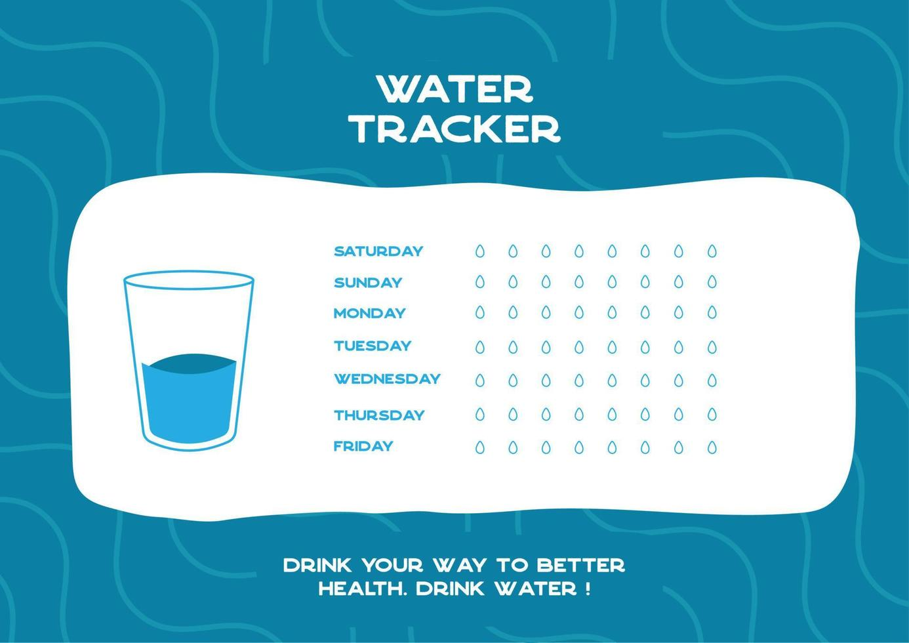

# Water Tracker

Water Tracker -  stay hydrated and feel your best with HydrateMe, the ultimate
water tracking app designed to help you meet your daily hydration goals. 
Whether you're an athlete, a busy professional, or just someone looking to improve
their health, HydrateMe makes it easy to keep track of your water
intake and stay on top of your hydration needs.

Key Features:

Customizable Goals: Set your daily water intake goal based on your weight, activity level, and personal preferences. HydrateMe will help you stay on track with reminders and notifications.

Intuitive Interface: A clean and user-friendly interface makes it simple to log your water intake throughout the day. Add a glass, a bottle, or a specific amount with just a few taps.

Reminders and Notifications: Set reminders to drink water at regular intervals. Get notified when it's time to hydrate, so you never forget a sip.

Progress Tracking: View your hydration progress over time with detailed charts and graphs. See how much water you've consumed and how close you are to reaching your daily goal.

Integration with Health Apps: Sync HydrateMe with popular health and fitness apps to get a comprehensive view of your overall wellness.

Motivational Quotes and Tips: Stay inspired with daily motivational quotes and hydration tips. Learn about the benefits of staying hydrated and how it can improve your health and well-being.

Community Support: Join a community of users who are also committed to staying hydrated. Share tips, challenges, and successes to keep each other motivated.

Why Choose HydrateMe?

Personalized Experience: HydrateMe adapts to your needs, providing a personalized hydration plan that fits your lifestyle.
User-Friendly: Designed with simplicity in mind, making it easy for anyone to use.
Comprehensive Features: From goal setting to progress tracking, HydrateMe has everything you need to stay hydrated.
Community and Support: Connect with others who are on the same journey, and get the support you need to succeed.
Download HydrateMe today and take the first step towards a healthier, more hydrated you!

